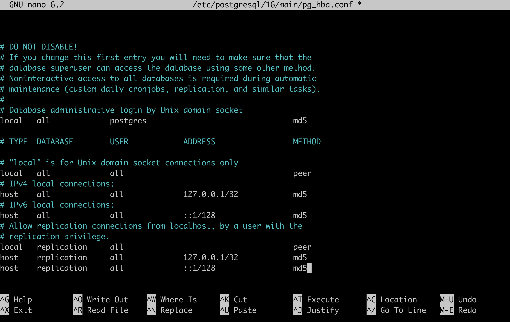

# Setup instructions

This page instructs software engineers how to get started working with the Django codebase and PostgreSQL database for the "core" Seshat webapp. It assumes the engineer has access to a dumpfile of the Seshat "core" database.

## Local setup

Local setup steps have been tested on an M1 Mac and on an Ubuntu VM running on the Mac.

<details><summary>Example Ubuntu VM setup on Mac</summary>

1. A quick way is to use multipass which can be installed with brew:
    ```
        brew install multipass
    ```
    - Note: the images used by Multipass don’t have a pre-installed graphical desktop
2. Create a VM (Ubuntu 22.04)
    ```
        multipass launch 22.04
    ```
    - This should create a VM called `primary` by default
3. Make sure the VM has enough resources:
    ```
        multipass stop primary
        multipass set local.primary.cpus=4
        multipass set local.primary.disk=60G
        multipass set local.primary.memory=8G
        multipass start primary
    ```
4. Mount the dir containing the database dump to the VM:
    ```
        multipass mount /path/to/database_dumps/ primary:database_dumps
    ```
5. Then log in to the VM with `multipass shell` and install pre-requisites:
    ```
        sudo apt update
        sudo add-apt-repository ppa:deadsnakes/ppa
        sudo apt install python3.8 -y
        sudo apt install python3.8-venv -y
        sudo apt-get install python3.8-dev -y
        sudo apt-get install g++ -y
    ```

</details>

### Local Setup Steps

1. Ensure you have a working installation of Python 3

2. Set up a virtual environment for the project using e.g. venv or conda
    - Note: The application has been tested with Python **3.8.13**
    - Conda example:
        ```
            conda create --name seshat python=3.8.13
            conda activate seshat
        ```
    - venv example:
        ```
            python3.8 -m venv seshat
            source seshat/bin/activate
        ```

3. Either create a fork of the GitHub repo with all branches: https://github.com/MajidBenam/seshat or use https://github.com/edwardchalstrey1/seshat for spatial dev work

4. Clone the repo e.g.
    ```
        git clone https://github.com/edwardchalstrey1/seshat
    ```

5. Install PostgreSQL/PostGIS and create empty database

    - <details><summary>macOS</summary>

        - Installation: follow the instructions to install https://postgresapp.com/ which **gives you PostgreSQL version 16 with PostGIS installed**
        - Create db: open psql with `psql postgres` and run:
            ```
                CREATE DATABASE <seshat_db_name>;
                CREATE EXTENSION postgis;
            ```
        </details>

    - <details><summary>Ubuntu</summary>

        - Installation
            ```
                sudo apt install gnupg2 wget vim -y

                sudo sh -c 'echo "deb http://apt.postgresql.org/pub/repos/apt $(lsb_release -cs)-pgdg main" > /etc/apt/sources.list.d/pgdg.list'

                curl -fsSL https://www.postgresql.org/media/keys/ACCC4CF8.asc | sudo gpg --dearmor -o /etc/apt/trusted.gpg.d/postgresql.gpg

                sudo apt update
                
                sudo apt install postgresql-16 postgresql-contrib-16 postgresql-16-postgis-3 -y
                
                sudo systemctl start postgresql

                sudo systemctl enable postgresql
            ```
        - Create db: open psql with `sudo -u postgres psql` and run:
            ```
                CREATE DATABASE <seshat_db_name>;
            ```
        - Add PostGIS to db: open psql with `sudo -u postgres psql -d <seshat_db_name>` and run:
            ```
                CREATE EXTENSION postgis;
            ```
        

        </details>


9. Install and configure GDAL and GEOS
    - <details><summary>Install instructions for macOS</summary>

        ```
            brew install gdal
            brew install geos
        ```
        </details>
    - <details><summary>Install instructions Ubuntu</summary>

        ```
            sudo apt-get install gdal-bin -y
            sudo apt-get install libgdal-dev -y
            sudo apt install libgeos++-dev libgeos3.10.2 -y
            sudo apt install libgeos-c1v5 libgeos-dev libgeos-doc -y
        ```
        - Note: you could first check the available libgeos version with: `sudo apt search libgeos`
        </details>
    - Open `seshat/settings/local.py` and edit the following variables:
        - `GDAL_LIBRARY_PATH`
        - `GEOS_LIBRARY_PATH`
    - Note: there are hardcoded paths in local.py for the Mac and Ubuntu instructions above included

6. After PostgreSQL, GDAL and GEOS are installed, install the Python packages in your environment (some packages have these as dependencies). From the top level of the `seshat` repo:
    ```
        pip install -r requirements.txt
        pip install "django-geojson [field]"
    ```

7. Restore Seshat database from dump file:

    - <details><summary>macOS</summary>

        ```
            pg_restore -U postgres -d <seshat_db_name> /path/to/file.dump
        ```
        </details>
    - <details><summary>Ubuntu</summary>

        - `sudo nano /etc/postgresql/16/main/pg_hba.conf`
        - On the line `local all postgres peer` change "peer" to "trust"
        - Reload postgres and populate the db:
            ```
                sudo systemctl reload postgresql
                sudo psql -U postgres <seshat_db_name> < /path/to/file.dump
            ```
        </details>

8. Add a password to the db for security

    - <details><summary>macOS</summary>

        - Add a password for the superuser with `psql -U postgres`:
            ```
                ALTER USER postgres WITH PASSWORD '<db_password>';
            ```
        - Locate `pg_hba.conf` if you don't know where it is
            ```
                psql -U postgres -c 'SHOW hba_file;'
            ```
        - Update postgres to use md5 with `nano /path/to/pg_hba.conf`
            
        </details>
    - <details><summary>Ubuntu</summary>

        - Add a password for the superuser with `sudo -u postgres psql`:
            ```
                ALTER USER postgres WITH PASSWORD '<db_password>';
            ```
        - Update postgres to use md5 with `sudo nano /etc/postgresql/16/main/pg_hba.conf`
            
        - Reload postgres
            ```
                sudo systemctl reload postgresql
            ```
        </details>

8. Create a config with your database info for Django
    - Within the repo, create a file called `seshat/settings/.env` with the db connection vars
    - For example:
        ```
            NAME=<seshat_db_name>
            USER=postgres
            HOST=localhost
            PORT=5432
            PASSWORD=<db_password>
        ```
    - The presence of this file will ensure Django connects to your local database

9. Ensure that database migrations have run for the "core" Django app:
    ```
        python manage.py migrate core
    ```

10. If the shape data tables are not yet populated in your copy of the Seshat core database and you have access to source data, populate one or more of them with the instructions in [spatialdb.md](spatialdb.md).

11. Run Django
    - <details><summary>macOS</summary>

        ```
            python manage.py runserver
        ```

        The webapp should be visible in a browser at http://127.0.0.1:8000/
        </details>
    - <details><summary>Ubuntu VM set up with multipass on Mac</summary>

        - Check IP inside VM:
            ```
                ip addr show
            ```
            - e.g. `192.168.64.3`
        - In the VM, ensure the firewall doesn't block incoming connections on port 8000:
            ```
                sudo ufw allow 8000
            ```
        - In a mac terminal run:
            ```
                multipass exec primary -- sudo iptables -t nat -A PREROUTING -p tcp --dport 8000 -j DNAT --to-destination 192.168.64.3:8000
            ```
            - Where `192.168.64.3` is the IP address
        - Restart the VM:
            ```
                multipass restart primary
            ```
        - Log back into the VM with `multipass shell` and run the django app:
            - Remember to firstactivate the venv e.g.
                ```
                    source seshat/bin/activate
                ```
            ```
                python manage.py runserver 0.0.0.0:8000
            ```
            - Go to http://192.168.64.3:8000/ in a browser (where `192.168.64.3` is the IP address)
            </details>
    


## Azure setup

This page instructs software engineers how to set up a testing version of the Seshat website on MS Azure. You'll need an account on Azure and to have set up and credited a subscription. These are the steps followed at The Alan Turing Institute:

1. Create an Ubuntu 22.04 VM:
    - e.g. `Standard D4plds v5 (4 vcpus, 8 GiB memory)`
    - Choose a 64GB disk
    - Choose ssh as access method and download private key on VM creation
    - Keep the user as the default `azureuser`
    - Change key permissions: `chmod 400 /path/to/key.pem`
    - SSH in like:
        ```
            ssh -i /path/to/key.pem azureuser@<public IP>
        ```
2. Upload the database dump with SCP:
    ```
        scp -i /path/to/key.pem /path/to/dumpfile.dump azureuser@<public IP>:/home/azureuser/db_dumps/
    ```
3. Upload the shape datasets described in [spatialdb.md](spatialdb.md) with SCP too if those database tables aren't already populated in the database the dump was created from
4. Follow the setup steps above for Ubuntu to install everything and create the db
    - Save the db password for the postgres user in Azure key vault
    - When you clone the repo, check out the `azure` branch
    - Update `ALLOWED_HOSTS` in `seshat/settings/base.py` and `seshat/settings/local.py` with the IP address of the VM if different from what's saved there
    - Populate spatial data tables by following [spatialdb.md](spatialdb.md) if needed
5. Update network security rules for the VM
    - Go to "Network Security" on the VM in the Azure portal and add the default inbound security rules to allow:
        - HTTP (port 80)
        - HTTPS (port 443)
        - Custom one for port 8000
    - SSH into the VM and run:
        ```
            sudo ufw allow 8000
        ```
6. Run django
    - SSH into the VM and activate the venv, then:
        ```
            export DJANGO_SETTINGS_MODULE=seshat.settings.local
            gunicorn seshat.wsgi:application --config gunicorn.conf.py
        ```
        Note: For some reason I could not get the `DJANGO_SETTINGS_MODULE` to be set via the `wsgi.py` correctly, so setting it manually here.
    - Go to `http://<public IP>:8000/`

## Pulumi

### Pre-requisites

1. [Install Pulumi](https://www.pulumi.com/docs/clouds/azure/get-started/begin/). e.g. on Mac:
    ```
        brew install pulumi/tap/pulumi
    ```
2. Install the [Azure CLI](https://learn.microsoft.com/en-us/cli/azure/install-azure-cli)

Use the configuration in `/pulumi` or set up from scratch:
```
    pulumi new azure-python
```

In `/pulumi` we:
- Chose sensible project name: `seshat-dev`
- Chose default stack name
- Chose `UKSouth` location
- Made custom edits to the config files for the Seshat app

### Azure Setup

How to run a full setup of the Seshat django app on Azure with Pulumi following [this guide](https://www.pulumi.com/docs/clouds/azure/get-started/begin/).

- Assumes Python 3 already installed on local machine so you can use the venv.
- The region specified in the Pulumi code is "UKSouth".

1. Ensure logged in and that the subscription you will use comes up in the list of subscriptions printed out, then set to that subscription:
    ```
        az login
        az account set --subscription "<subscription-id>"
    ```
2. Activate Pulumi venv and install relevant package
    ```
        cd pulumi
        source venv/bin/activate
        pip install -r requirements.txt
    ```
3. Configure Pulumi with your ssh public key:
    ```
        pulumi config set --secret sshPublicKey "$(cat ~/.ssh/id_rsa.pub)"
    ```
4. Deploy the app
    ```
        pulumi up
    ```